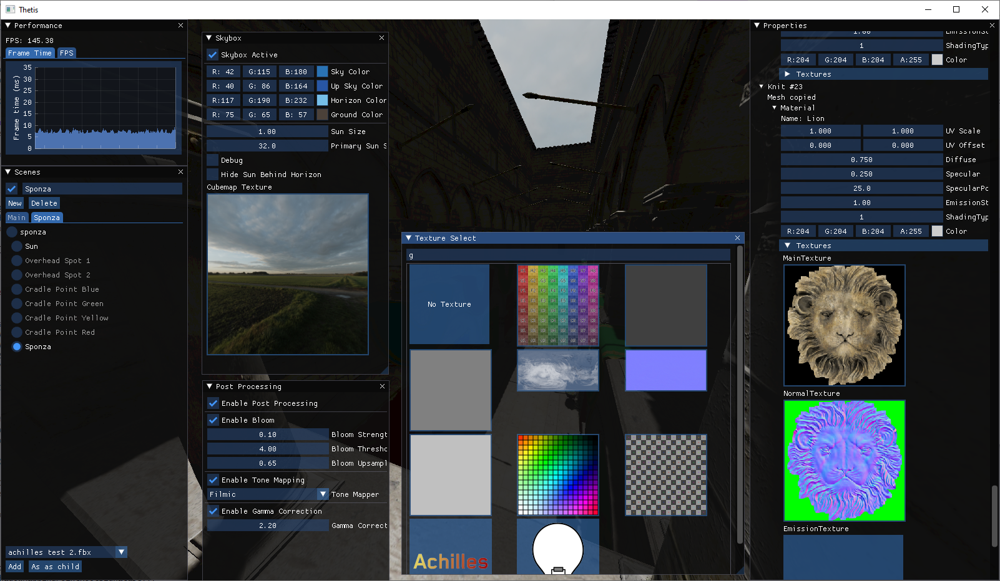

# Achilles

**Achilles** is a game engine I have written in D3D12, initially following the [3dgep tutorial](https://www.3dgep.com/learning-directx-12-1/). It follows the traditional forward rendering technique to allow for custom shaders but with a Z pre-pass to reduce pixel overdraw. I use *assimp* to load meshes and *DirectXTex* to load textures. The engine supports keyboard, mouse and gamepads thanks to *DirectXTK12*. It also supports lighting, shadows, some post processing, and MSAA 4x by default. 

**Thetis** is the "game", though at this point merely serves as an editor. I use imgui and implot for the UI. You will see this as the window title for the screenshots below. 

## Images

### Example Scene

This is an example scene I made with the UI turned off. Suzanne, the monkey face on the left, is from Blender; the duck is from the glTF 2.0 Samples; and the tree is made by myself. The duck has embedded textures, the floor has a texture loaded & applied in code and the tree had relative textures loaded when the model was. They are all being lit by one directional light with cascaded shadow maps enabled.

### Pointlights

Each pointlight is represented by an editor-only sprite, which is coloured based on the light colour. To allow for CPU frustum culling, each direction is rendered separately, one such direction can be seen in the bottom right. The PCF filtering is a bit over the top at the moment for demonstration purposes. The Sponza scene is modified from the glTF 2.0 samples, which itself is from Crytek. 

### Cascaded Shadow Maps

To exaggerate the cascade effect, show in red green and blue, I have reduced the far viewing plane signitifcantly. Each material has an option to render with the cascades displayed and I chose only the floor material to show the debug information. Cascades are created with Fit to Cascade and use Map-Based Cascade Selection.

### Some Submenus in Thetis

As seen in previous screenshots, there is a *Performance* graph window in the top left, a *Scenes* window on the left underneath that and on the right there is the *Properties* window.

The Scenes panel has a bar where you can select your scene, above which a checkbox and textbox reside where you can toggle and rename the currently selected scene. Underneath that is the hierarchy of objects, each child level being indented away from its parent. Objects can be selected by clicking on the radio button on the left of their name. At the bottom of the scene panel is an object addition combobox, which allows you to add objects that are stored in the *content* directory next to the executable.

The Properties window shows information for the currently selected object. Every object has a active state, a name, a position, rotation and scale. For ease of debugging this is given as local and world transforms, along with local and world matrix. For lights the properties panel will include the global ambient light, the light properties such as color, strength, attenuation and a red-scale view of the depth information. For meshes the properties will include UV scale & offset, material properties and textures. 

Other windows in the screenshot include a *Skybox* selection with a dynamic sky & sun shader and a cubemap texture selector. Underneath that is *Post Processing* where bloom, tone mapping and gamma correction can be applied and modified. To the right of those two is the *Texture Select* screen which allows the user to search and filter through all the textures in the cache to replace or apply them to an existing material. All of these popup menus can be moved around and resized. 

## Some more details

* The main shader at the moment is *BlinnPhong*, though other shaders can be written for the game as required
* Shadows are supported for each light type. Number of lights in a scene is unlimited though only so many can cast a shadow however these limits can be easily increased
  * Directional - up to 4 shadow casters, each with up to 6 cascades (or no cascades at all)
  * Spot - up to 8 shadow casters
  * Point - up to 6 shadow casters, each with the required 6 faces
* Shadows are rendered at 30 fps to increase performance, but this can be changed or flagged to redraw the shadows in a frame
* Vertex and index buffers are stored in the *Mesh* class while *Mesh* and *Material* classes are stored in a *Knit*
* Frustum culling is CPU-based and done based on a mesh's AABB, created from it's OBB when the mesh is loaded
* Files can be dragged onto the window to load textures and meshes. Relative, absolute and embedded textures are handled for meshes
* Objects in the parent hierarchy structure move, rotate and scale with their parent
* Objects can be selected in the Scenes panel or by picking via left clicking on the object in the scene
* Achilles was the first name that came to mind when naming this project. The name sounded cool so I've stuck with it